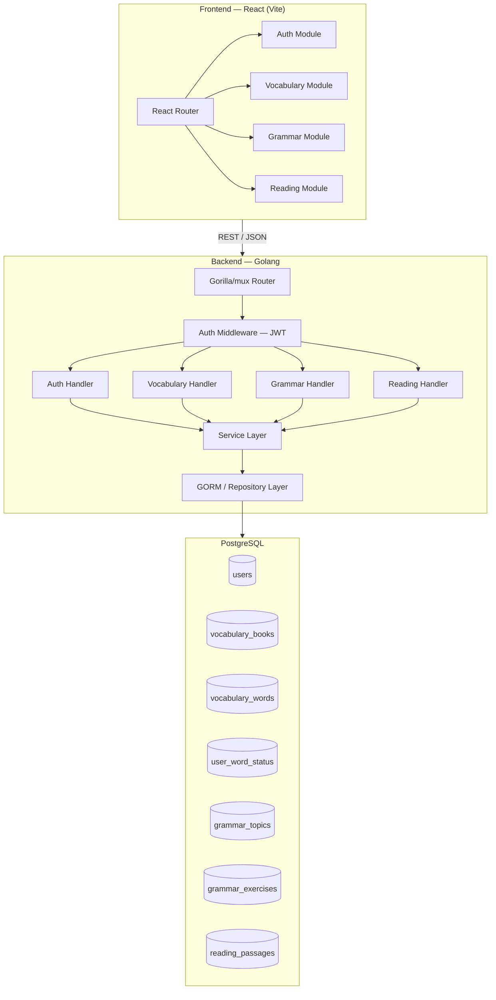
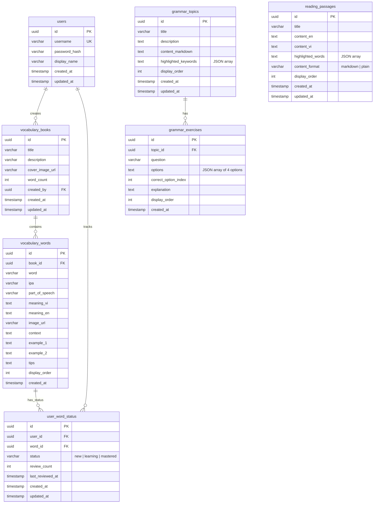
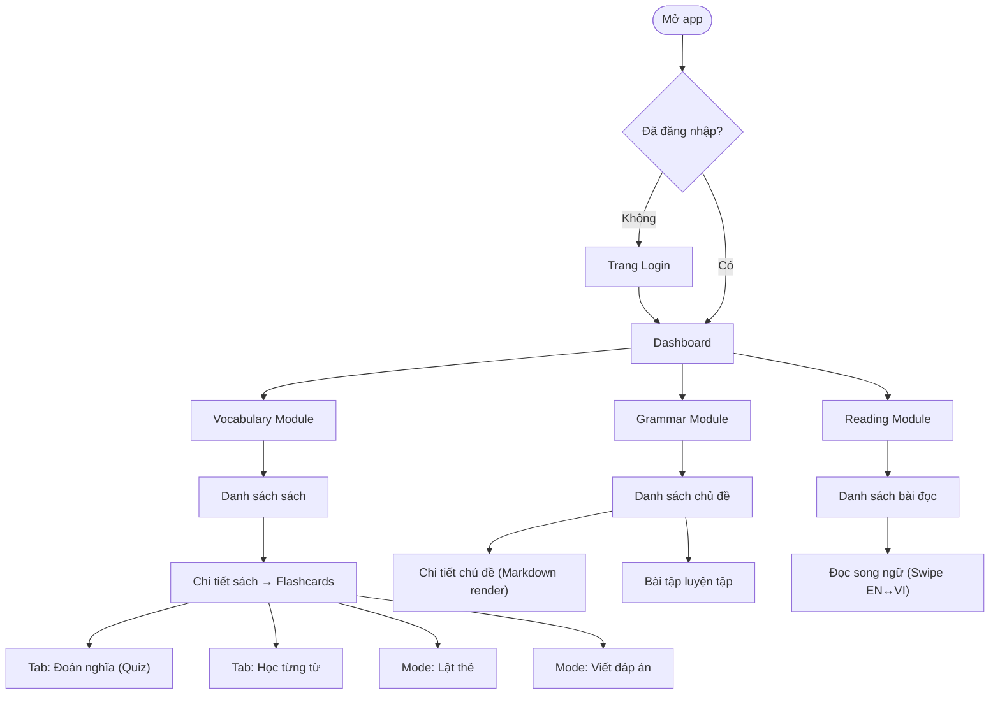
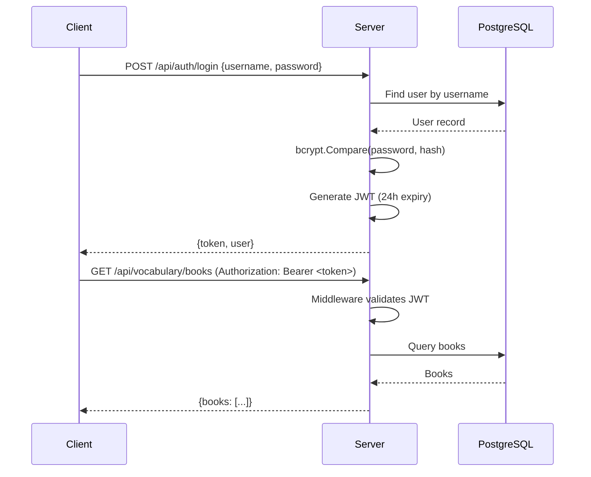

# Learning English — Kế hoạch dự án toàn diện

> React · Golang (Gorilla/mux + GORM + Swagger) · PostgreSQL

---

## 1. Kiến trúc hệ thống tổng quan



### Thư mục dự án

```
learning-english/
├── frontend/                   # React app (Vite)
│   ├── public/
│   ├── src/
│   │   ├── api/                # Axios instance & API clients
│   │   ├── assets/
│   │   ├── components/         # Shared UI components
│   │   ├── contexts/           # React contexts (Auth…)
│   │   ├── hooks/              # Custom hooks
│   │   ├── layouts/
│   │   ├── modules/
│   │   │   ├── auth/
│   │   │   ├── vocabulary/
│   │   │   ├── grammar/
│   │   │   └── reading/
│   │   ├── routes/
│   │   ├── styles/
│   │   ├── utils/
│   │   ├── App.jsx
│   │   └── main.jsx
│   ├── index.html
│   ├── package.json
│   └── vite.config.js
│
├── backend/
│   ├── cmd/server/main.go      # Entry point
│   ├── internal/
│   │   ├── config/             # Env / config loader
│   │   ├── middleware/         # JWT auth, CORS, logging
│   │   ├── models/            # GORM models
│   │   ├── repository/        # DB queries
│   │   ├── service/           # Business logic
│   │   ├── handler/           # HTTP handlers
│   │   ├── router/            # Route registration
│   │   └── dto/               # Request/Response DTOs
│   ├── migrations/            # SQL migration files
│   ├── docs/                  # Swagger generated
│   ├── go.mod
│   └── go.sum
│
├── docker-compose.yml
├── Makefile
└── README.md
```

---

## 2. Database Schema



### SQL migrations (tóm tắt)

Sẽ tạo file migration tuần tự trong `backend/migrations/`:

| File | Nội dung |
|---|---|
| `001_create_users.sql` | Bảng `users` + index username |
| `002_create_vocabulary.sql` | Bảng `vocabulary_books`, `vocabulary_words` |
| `003_create_user_word_status.sql` | Bảng `user_word_status` + unique(user_id, word_id) |
| `004_create_grammar.sql` | Bảng `grammar_topics`, `grammar_exercises` |
| `005_create_reading.sql` | Bảng `reading_passages` |

---

## 3. API Endpoints

### Auth

| Method | Path | Mô tả |
|---|---|---|
| `POST` | `/api/auth/register` | Đăng ký tài khoản |
| `POST` | `/api/auth/login` | Đăng nhập → JWT token |
| `GET` | `/api/auth/me` | Lấy thông tin user hiện tại |

### Vocabulary

| Method | Path | Mô tả |
|---|---|---|
| `GET` | `/api/vocabulary/books` | Danh sách sách từ vựng |
| `POST` | `/api/vocabulary/books` | Tạo sách từ vựng |
| `GET` | `/api/vocabulary/books/{id}` | Chi tiết sách |
| `PUT` | `/api/vocabulary/books/{id}` | Cập nhật sách |
| `DELETE` | `/api/vocabulary/books/{id}` | Xóa sách |
| `GET` | `/api/vocabulary/books/{id}/words` | Danh sách từ trong sách |
| `POST` | `/api/vocabulary/books/{id}/words` | Thêm từ vào sách |
| `PUT` | `/api/vocabulary/words/{id}` | Cập nhật từ |
| `DELETE` | `/api/vocabulary/words/{id}` | Xóa từ |
| `GET` | `/api/vocabulary/books/{id}/quiz` | Lấy quiz đoán nghĩa (4 đáp án) |
| `PUT` | `/api/vocabulary/words/{id}/status` | Cập nhật trạng thái từ (new/learning/mastered) |
| `GET` | `/api/vocabulary/books/{id}/words?status=new&order=random` | Lọc & sắp xếp từ |

### Grammar

| Method | Path | Mô tả |
|---|---|---|
| `GET` | `/api/grammar/topics` | Danh sách chủ đề ngữ pháp |
| `POST` | `/api/grammar/topics` | Tạo chủ đề (import markdown) |
| `GET` | `/api/grammar/topics/{id}` | Chi tiết chủ đề + nội dung |
| `PUT` | `/api/grammar/topics/{id}` | Cập nhật chủ đề |
| `DELETE` | `/api/grammar/topics/{id}` | Xóa chủ đề |
| `GET` | `/api/grammar/topics/{id}/exercises` | Bài tập theo chủ đề |
| `POST` | `/api/grammar/topics/{id}/exercises` | Thêm bài tập |
| `PUT` | `/api/grammar/exercises/{id}` | Sửa bài tập |
| `DELETE` | `/api/grammar/exercises/{id}` | Xóa bài tập |

### Reading

| Method | Path | Mô tả |
|---|---|---|
| `GET` | `/api/reading/passages` | Danh sách bài đọc |
| `POST` | `/api/reading/passages` | Tạo bài đọc (import markdown/plain) |
| `GET` | `/api/reading/passages/{id}` | Chi tiết bài đọc |
| `PUT` | `/api/reading/passages/{id}` | Cập nhật bài đọc |
| `DELETE` | `/api/reading/passages/{id}` | Xóa bài đọc |

---

## 4. UI Flows & Component Tree

### 4.1 Luồng chính



### 4.2 Component Tree

```
<App>
├── <AuthProvider>
│   ├── <Router>
│   │   ├── <PublicLayout>
│   │   │   └── <LoginPage />
│   │   │
│   │   ├── <PrivateLayout>
│   │   │   ├── <Sidebar />
│   │   │   ├── <Header />
│   │   │   │
│   │   │   ├── <DashboardPage />
│   │   │   │
│   │   │   ├── <VocabularyModule>
│   │   │   │   ├── <BookListPage>
│   │   │   │   │   └── <BookCard />  (× N)
│   │   │   │   │
│   │   │   │   └── <BookDetailPage>
│   │   │   │       ├── <StudySettings>
│   │   │   │       │   ├── <OrderToggle />      (random/sequential/repeat)
│   │   │   │       │   ├── <DirectionToggle />  (EN→VI / VI→EN)
│   │   │   │       │   ├── <IPAToggle />
│   │   │   │       │   └── <StatusFilter />     (new/learning/mastered)
│   │   │   │       │
│   │   │   │       ├── <TabBar tabs={["Đoán nghĩa","Học từng từ"]} />
│   │   │   │       │
│   │   │   │       ├── <QuizTab>
│   │   │   │       │   ├── <WordDisplay />
│   │   │   │       │   └── <OptionGrid />  (4 đáp án)
│   │   │   │       │
│   │   │   │       ├── <LearnTab>
│   │   │   │       │   └── <FlashCard>
│   │   │   │       │       ├── <WordHeader />   (word + IPA + part of speech)
│   │   │   │       │       ├── <WordImage />
│   │   │   │       │       ├── <MeaningSection />
│   │   │   │       │       ├── <ContextSection />
│   │   │   │       │       ├── <ExamplesSection />
│   │   │   │       │       └── <TipsSection />
│   │   │   │       │
│   │   │   │       └── <ModeSelector>
│   │   │   │           ├── <FlipMode />
│   │   │   │           └── <WriteMode>
│   │   │   │               └── <AnswerInput />
│   │   │   │
│   │   │   ├── <GrammarModule>
│   │   │   │   ├── <TopicListPage>
│   │   │   │   │   └── <TopicCard /> (× N)
│   │   │   │   │
│   │   │   │   ├── <TopicDetailPage>
│   │   │   │   │   └── <MarkdownRenderer highlighted={keywords} />
│   │   │   │   │
│   │   │   │   └── <ExercisePage>
│   │   │   │       └── <ExerciseCard>
│   │   │   │           ├── <QuestionText />
│   │   │   │           └── <OptionList />
│   │   │   │
│   │   │   └── <ReadingModule>
│   │   │       ├── <PassageListPage>
│   │   │       │   └── <PassageCard /> (× N)
│   │   │       │
│   │   │       └── <PassageReaderPage>
│   │   │           └── <BilingualSwiper>
│   │   │               ├── <ContentPanel lang="en" />
│   │   │               └── <ContentPanel lang="vi" />
```

### 4.3 Mô tả chi tiết UI cho từng module

#### Vocabulary — Tab "Đoán nghĩa"
- Hiển thị 1 từ tiếng Anh (hoặc nghĩa tiếng Việt nếu chế độ VI→EN)
- 4 nút đáp án dạng grid 2×2
- Chọn đúng → highlight xanh → auto chuyển từ tiếp (delay 1s)
- Chọn sai → highlight đỏ → hiện đáp án đúng

#### Vocabulary — Tab "Học từng từ"
- Card lớn hiển thị đầy đủ thông tin
- Nút Previous / Next để di chuyển
- Mode lật thẻ: mặt trước = từ, mặt sau = nghĩa + chi tiết (tap/click để lật)
- Mode viết: hiển thị nghĩa, người dùng nhập từ → check đúng/sai

#### Grammar — Nội dung chủ đề
- Render Markdown với `react-markdown` / `react-syntax-highlight`
- Từ khóa trong `highlighted_keywords` → tô vàng `<mark>`
- Bài tập: dạng trắc nghiệm, nhóm theo chủ đề

#### Reading — Song ngữ
- 2 panel ngang (EN | VI) có thể swipe qua lại
- Trên mobile: swipe gesture; trên desktop: nút chuyển hoặc kéo
- Nội dung dài render toàn bộ (không phân trang, không scroll riêng)
- Từ khóa highlight vàng

---

## 5. Chi tiết kỹ thuật Backend

### 5.1 JWT Authentication Flow



### 5.2 Quiz Generation Logic

```
GET /api/vocabulary/books/{id}/quiz?count=10

1. Lấy tất cả words trong book
2. Chọn `count` từ (random shuffle)
3. Với mỗi từ:
   a. Câu hỏi = word (hoặc meaning nếu VI→EN)
   b. Đáp án đúng = meaning_vi (hoặc word)
   c. 3 đáp án sai = random từ 3 word khác trong book
   d. Shuffle 4 đáp án
4. Trả về [{word, options: [4], correct_index}]
```

### 5.3 Packages sử dụng (Backend)

| Package | Mục đích |
|---|---|
| `github.com/gorilla/mux` | HTTP router |
| `gorm.io/gorm` | ORM |
| `gorm.io/driver/postgres` | PostgreSQL driver |
| `github.com/golang-jwt/jwt/v5` | JWT tokens |
| `golang.org/x/crypto/bcrypt` | Password hashing |
| `github.com/swaggo/swag` | Swagger doc generation |
| `github.com/swaggo/http-swagger` | Swagger UI |
| `github.com/rs/cors` | CORS middleware |
| `github.com/joho/godotenv` | .env loading |
| `github.com/google/uuid` | UUID generation |

### 5.4 Packages sử dụng (Frontend)

| Package | Mục đích |
|---|---|
| `react-router-dom` | Routing |
| `axios` | HTTP client |
| `react-markdown` | Render markdown (Grammar) |
| `remark-gfm` | GitHub-flavored markdown |
| `framer-motion` | Animations (flip card, transitions) |
| `swiper` | Swipe gesture (Reading bilingual) |
| `react-icons` | Icons |
| `react-hot-toast` | Notifications |

---

## 6. Error Handling

### Backend

```go
// Cấu trúc lỗi chuẩn
type APIError struct {
    Code    int    `json:"code"`
    Message string `json:"message"`
    Details string `json:"details,omitempty"`
}

// HTTP status codes sử dụng
// 400 Bad Request     — validation failed
// 401 Unauthorized    — missing/invalid token
// 403 Forbidden       — không có quyền
// 404 Not Found       — resource không tồn tại
// 409 Conflict        — duplicate (username đã tồn tại)
// 500 Internal Error  — unexpected server error
```

- Middleware recovery handler bắt panic
- Logging mọi request (method, path, status, duration)
- Validation input tại handler layer trước khi xuống service

### Frontend

| Tình huống | Xử lý |
|---|---|
| Token hết hạn (401) | Tự động redirect về Login, clear token |
| Network error | Toast "Mất kết nối, vui lòng thử lại" |
| Validation error (400) | Hiển thị inline error trên form |
| 404 | Hiển thị trang "Không tìm thấy" |
| 500 | Toast "Có lỗi xảy ra, vui lòng thử lại sau" |

- Axios interceptor xử lý global errors
- React Error Boundary cho component crashes
- Loading states & skeleton screens

---

## 7. Verification Plan

### Automated Tests

#### Backend (Go tests)
```bash
# Chạy tất cả tests
cd backend && go test ./... -v

# Chạy test với coverage
cd backend && go test ./... -cover -coverprofile=coverage.out
```

- **Unit tests** cho service layer (logic quiz generation, password hashing, JWT)
- **Integration tests** cho repository layer (dùng test database hoặc sqlmock)
- **Handler tests** dùng `httptest` để test HTTP endpoints

#### Frontend (Vitest)
```bash
# Chạy tests
cd frontend && npm test

# Chạy tests với coverage
cd frontend && npm run test:coverage
```

- **Component tests** dùng `@testing-library/react`
- **Hook tests** dùng `renderHook`

### Manual Verification

> [!IMPORTANT]
> Vì đây là dự án greenfield, cần bạn hỗ trợ xác nhận các bước test thủ công phù hợp. Dưới đây là đề xuất:

1. **Auth Flow**: Mở browser → Register → Login → Verify token trong localStorage → Truy cập protected page
2. **Vocabulary**: Tạo sách → Thêm từ → Mở flashcard → Test quiz (chọn đúng/sai) → Test lật thẻ → Test viết đáp án
3. **Grammar**: Import markdown → Verify render + highlight → Làm bài tập
4. **Reading**: Import bài đọc → Swipe EN↔VI → Verify highlight

---

## 8. Phân pha triển khai

| Phase | Nội dung | Ước lượng |
|---|---|---|
| **Phase 1** | Project setup (Vite + Go), Docker, DB migrations, Auth (register/login/JWT) | 2-3 ngày |
| **Phase 2** | Vocabulary module — CRUD books & words, Flashcard UI, Quiz tab, Learn tab | 3-4 ngày |
| **Phase 3** | Vocabulary settings — Modes (flip/write), Filters (status/order/direction/IPA) | 2 ngày |
| **Phase 4** | Grammar module — CRUD topics, Markdown import & render, Highlight, Exercises | 2-3 ngày |
| **Phase 5** | Reading module — CRUD passages, Bilingual swiper, Markdown/plain import, Highlight | 2-3 ngày |
| **Phase 6** | Polish — Responsive design, animations, error handling, Swagger docs | 2 ngày |
| **Phase 7** | Testing & deployment — Unit/integration tests, Docker compose, CI/CD | 2 ngày |
